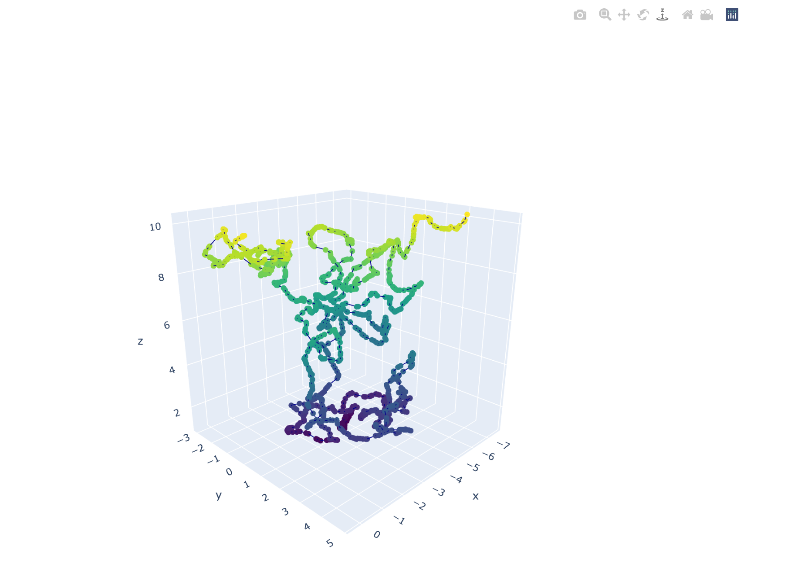

===
Important!

To look at the photon path, you need to either run the program yourself or DOWNLOAD the .html files from /Photon_Path_3D. The HTML files will render locally. 
Once you have doneloaded the HTML files, simple open with Chrome/Edge/any browser. It should look like 
===

"photon_path_final.py" is the finally working version with plot commands. You can play with it yourself without any knowledge. 

Cloud property contains sensitive data, hence won't be published. Please use your own data set.

Use photon_path.py to run simulation. 

A few exaples are published
